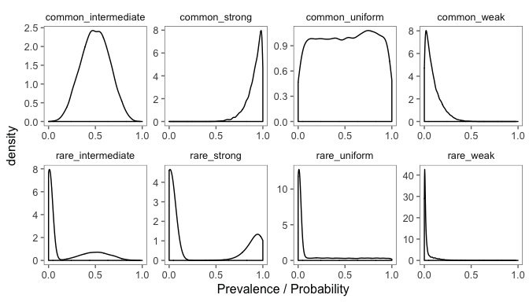
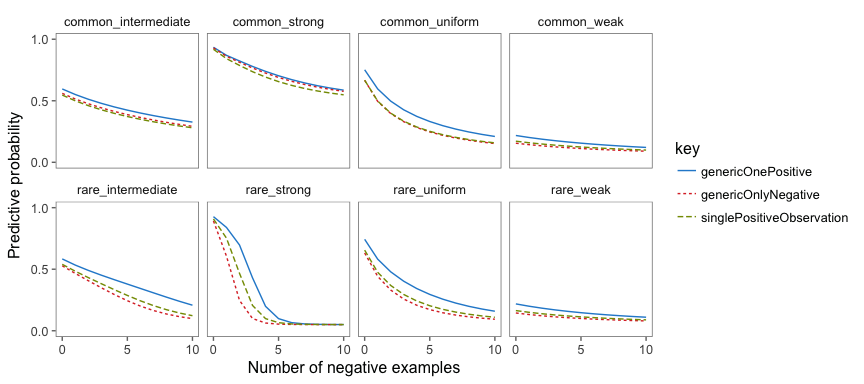

Generics and exploration
================
MHT
8/24/2017

### Introduction

In this study, we are examining children's exploration of a novel property of a novel category upon hearing a generic ("feps are sticky") vs. specific ("this fep is sticky") language and observing negative evidence (during exploration, none of the feps stick).

To model the **generic langauge condition**, we use the generics model of Tessler & Goodman, with an ideal observer model (to make the observations). The generics model takes a generic utterance and returns a posterior distribution on the probability that the next fep will have the feature. This posterior probability is used to model the observations as well, in the standard Bayesian way.

To model the **specific language condition** ("This fep is sticky"), we have at least 2 options:

1.  A vanilla observation model. This would be assume weak-sampling (?)... "This fep is sticky" is tantamount to just seeing a fep stick.
2.  A habituals model (i.e., "This fep" relative to other feps), where the listener learns about the prior distribution over the prevalence of the feature within the category (i.e., learns about "other feps") via the specific utterance; this would assume strong sampling ("*This fep* is sticky"). This model would be similar to a backfiring model and would be similar in spirit to the phenomenon explored in Horowitz & Frank (2016; "This is a big modi. What do you think modis normally look like?").

This second option is more experimental / new modeling territory but fairly straight-forward.

Below, I've implemented the generics (+ observations) model and the vanilla observations model (1) to examine the influence of observations on generically-updated beliefs. This is the most simple extension of the generics model to include observations.

<!-- To preview the findings so far, observations have a very strong influence on beliefs (much more so than the generic utterance). -->
<!-- To understand why this is the case, consider that the generic *vaguely describes* the latent probability whereas direct observations are more closely tied to specific probabilities (something like that).  -->
<!-- Thus, the behavior of this model is generally at odds with the phenomenon that *generics are resilient to counterexamples*. -->
### Model of the prior

As in previous work, we assume the prior is structured according to conceptually different kinds of creatures. The most simple distinction is between kinds that having some stable causal mechanism that gives rise to the property vs. those that lack such a mechanism (cf, Griffiths & Tenenbaum, 2005). We will examine model behavior for priors that both do and do not have the *unstable* component.

``` r
priorModel <- '
var priorSampler = function(kindsOfThings, rates){
  // first sample a component from a mixture distribution
  // e.g., the "stable cause" component (generally has it) vs. "unstable cause" (generally doesnt have it) 
  var mixtureComponent = categorical(kindsOfThings);
  // sample a rate/frequency/probability/prevalence given a component
  var rate = beta(rates[mixtureComponent][0])
  return {component: mixtureComponent, prevalence: snap(rate)}
}

// turn into a distribution
var statePrior = Infer({method: "forward", samples: 10000, 
  model: function(){ 
    return priorSampler(priorParameters.kindsOfThings, priorParameters.rates) 
  } 
})
'
```

### Listener (generics) model (w. optional observations)

I'll look two version of the listener model. Both models hear the generic. One model also sees a positive example ("the demonstration fep"). Another model doesn't see a positive example. Both models then see increasing amounts of negative evidence.

That is, the generics model gets the generic statement either *alone* or *with 1 positive example*.

``` r
listenerModel <- '
var pragmaticListener = function(utterance, obs, qud, demonstrationFep) {
  Infer({method: "enumerate"}, function(){
    // GENERICS MODEL
    var state = sample(statePrior)    
    var qudFn = quds[qud]; // qud could be "component" or "prevalence" (makes very similar predictions in testing)
    var qudVal = qudFn(state);
    var threshold = thresholdPrior();
    var S1 = speaker1(qudVal, threshold, qud)
    observe(S1, utterance);
    ///////////////////////

    demonstrationFep ? // model observes demonstration fep (i.e., 1 positive example) ?
      observe(Binomial({p: state.prevalence, n: obs.n + 1}), obs.positive + 1) : 
      obs.n > 0 ? // if not, observe negative examples only when n > 0 (n = 0 corresponds to just generic)
        observe(Binomial({p: state.prevalence, n: obs.n}), obs.positive) : null
  
    // make a prediction about the next fep having the property
    return  flip(state.prevalence)
  })
}
'
```

### Vanilla observation model

This model observes 1 positive example (the demonstration fep) and increasing amounts of negative evidence.

``` r
observationModel <- '
var binomObservation = function(obs){
  Infer({method: "enumerate"}, function(){
   var state = sample(statePrior)  
    observe(Binomial({p: state.prevalence, n: obs.n + 1}), obs.positive + 1)
    return flip(state.prevalence)
  })
}
'
```

### Generate predictions

We'll look at a range of 0 - 10 observations (all of which will be negative evidence, i.e., the object does NOT have the property), and we'll look at predictions of the generics (+ observations) models (both with and without 1 positive example, plus negative examples) vs. the vanilla observations model (one positive example but negative examples).

``` r
generatePredictions <- '
var preds = map(function(nFepsTried){
  var observationalData = {n: nFepsTried, positive: 0}
    return {
     n: nFepsTried, 
     genericOnePositive: probability(pragmaticListener("generic", observationalData, "prevalence", true), true),
     genericOnlyNegative: probability(pragmaticListener("generic", observationalData, "prevalence", false), true),
     singlePositiveObservation: probability(binomObservation(observationalData), true)
   }
 }, _.range(0, 11))
preds
'
```

Possible priors to test.
------------------------

We examine the model under various assumptions about the prior. We consider four kinds of shapes to the "stable cause" component (i.e., the categories that most stably have the property): "uniform", "strong" (biased towards high probabilities), "weak" (biased towards low probabilities), and "intermediate" (biased towards probabilities around 0.5). In addition, we consider priors that do and do not have a second component, corresponding to "transient causes" of the property (or, accidental causes). This component favors probabilities close to 0, and has been an important part of modeling the data from the generics and related expts. With prior that assume a "transient" component, we set that probability of that component to 0.7, corresponding to a relatively "rare" property. Priors without this component are referred to as "common".



### Model predictions

Y-axis denotes the learner's degree of belief in the next fep having the property. Facets denote different assumptions about the prior. Blue solid line is generic + demonstration fep + negative observations. Dotted red line is generic + negative observations. Dashed green line is demonstration fep + negative observations.



Overall, the lines are very similar, showing the same sensitivity to the negative examples. Let's revisit what the x = 0 point means for the different models:

1.  Generic One Positive: hears "feps are sticky" and sees "demonstration fep"
2.  Generic Only Negative: hears "feps are sticky"
3.  Single Positive Observation: sees "demonstration fep"

x = 1 - 10 correspond to the amount of inert feps explored.

### Results so far

The blue line (Generic One Positive) is seemingly greater than the green line (single positive observation), suggesting that generic language is having some (positive) effect on the the beliefs of the model. One potentially concerning behavior is how the generics only negative model behaves, which is either the same as Single Positive Observation or it has less strong beliefs ("generic" weaker than observation). Also, of course, different assumptions about the prior lead to different posterior beliefs.
